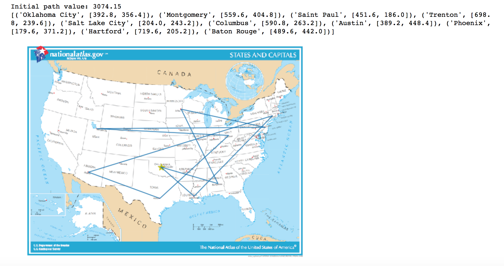
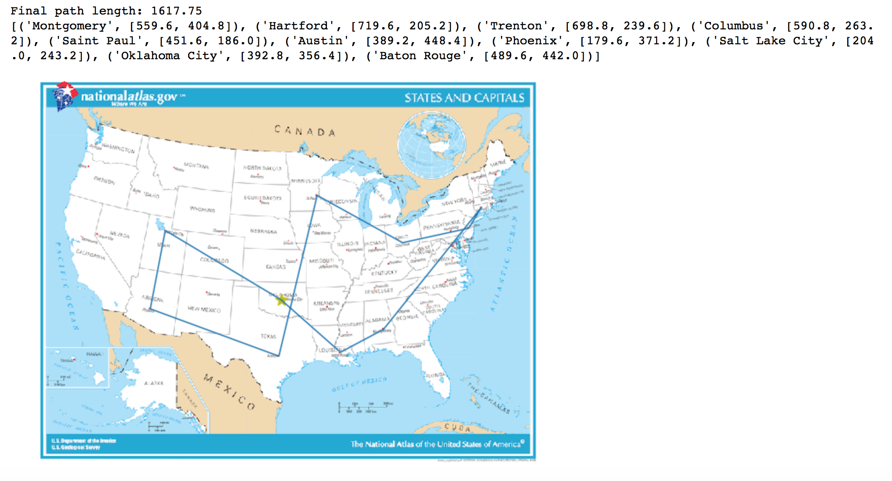

# Simulated Annealing
This exercise to check understanding of simulated annealing by implementing the algorithm in a Jupyter notebook and using it to solve the Traveling Salesman Problem (TSP) between US state capitals.

### How Simulated Annealing Works
Following graph search shows how simulated annealing works to find optimal path:

 We don't always improve - sometime we need to search

### Development Details
Following parts implemented into the simulated annealing code template for salesman problem:  
1- simulated_annealing() to find optimal path 
2- TravelingSalesmanProblem successors()   
3- TravelingSalesmanProblem get_value()   
4- schedule(time) to return temperature  

### Quickstart Guide
To launch the notebook, run the following command from a terminal with anaconda3 installed and on the application path:

    jupyter notebook Simulated_Annealing.ipynb

### Results
Example of the results  
1- Initial problem

2- Final result after apply simulated annealing to find shortest path between cities

